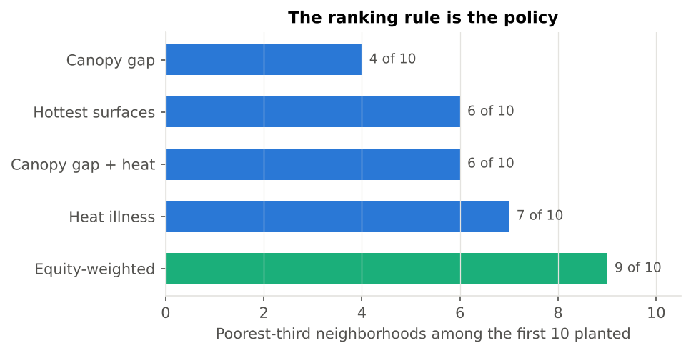
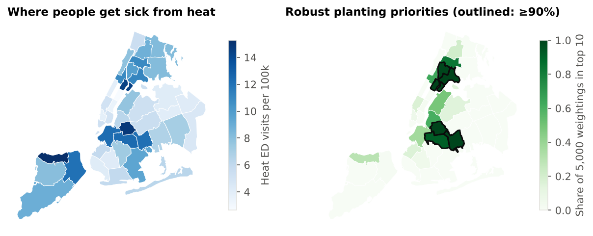

# Who Gets the Shade? Ranking New York Neighborhoods for Tree Planting

> 🌐 [Interactive map](https://johanarisato.github.io/geoai-for-cities/explore/shade.html) · [Full write-up on GeoAI for Cities](https://johanarisato.github.io/geoai-for-cities/) · [Portfolio](https://johanarisato.github.io/Johan.github.io/)

**Johan Fernandez** · Working paper, 2026 · Not yet peer reviewed

When a city ranks neighborhoods for tree planting, the ranking rule decides who benefits first. This study uses public data for all 42 New York City health neighborhoods (UHF42) to test two things:

1. Is the rule a technical detail or a policy choice that changes who benefits?
2. Can a heat-illness model be trusted outside the borough it learned from?

## Key findings (n = 42)

| Finding | Result |
|---|---|
| Shade cools | Each extra point of tree canopy goes with **0.174 °F** lower summer surface temperature (R² = 0.425). The spatial error model gives −0.183 °F. |
| Illness follows poverty, not heat | Heat-stress ER visits correlate with poverty (**r = 0.59**) far more than with surface temperature (r = 0.20). With both in one model, temperature is not significant (p = 0.37); poverty is (p < 0.001). |
| A cool-but-sick outlier | Port Richmond, Staten Island has relatively cool surfaces (91.5 °F) but the city's highest heat ER rate (15.3 per 100k). |
| The rule is the policy | Ranking by canopy gap puts **4** of the first 10 neighborhoods in the poorest third; an equity-weighted rule puts **9**. |
| Six robust priorities | Hunts Point–Mott Haven, Williamsburg–Bushwick, East Harlem, East New York, High Bridge–Morrisania and Bedford Stuyvesant–Crown Heights make the top 10 in at least 90% of 5,000 random weightings. |
| Models do not travel | Cross-validated R² drops from **0.26** (random 5-fold) to **−0.27** when a whole borough is held out: worse than predicting the average. |




## Data (all public)

| Variable | Source indicator | Year |
|---|---|---|
| Daytime summer surface temperature (°F, Landsat) | EHDP 688 | 2009 |
| Tree canopy (% of land) | EHDP 708 | 2014 |
| Vegetative cover (% of land) | EHDP 690 | 2010 |
| Poverty (% below federal poverty level, ACS) | EHDP 221 | 2013–17 |
| Heat-stress ER visits per 100k, age-adjusted | EHDP 537 | mean of 10 yearly rates |

Sources: [NYC Environment & Health Data Portal export](https://github.com/nycehs/All_EHDP_Data) and [UHF42 boundaries](https://github.com/nycehs/NYC_geography).

**Data-quality note.** In the portal export, Bensonhurst–Bay Ridge (UHF 209) is filed under code 208 (Canarsie–Flatlands). `01_build_dataset.py` re-keys every row by neighborhood name and asserts that each code matches its boundary name, so the error cannot slip back in silently.

## Methods

1. **Spatial clustering:** global Moran's I and local LISA clusters (k = 5 nearest neighbors, 9,999 permutations).
2. **Heat on canopy:** OLS compared with spatial lag and spatial error models, since neighboring areas are not independent.
3. **Heat illness:** ER visits on temperature and poverty together.
4. **Transferability:** random 5-fold cross-validation vs leave-one-borough-out.
5. **Ranking rules:** five rules for choosing the first 10 neighborhoods, plus 5,000 random (Dirichlet) weightings of the equity-weighted score.

## Run it

```bash
pip install -r requirements.txt
python code/00_download.py        # public inputs -> data/raw/
python code/01_build_dataset.py   # -> data/uhf42_shade.csv / .geojson
python code/02_analysis.py        # -> data/results.json
python code/03_figures.py         # -> figures/
pytest -q
```

The cleaned table is also a layer (`nyc_uhf42_shade`) in the shared [geoai-cities-db](https://github.com/JohanArisato/geoai-cities-db) spatial database, so other projects can query it with SQL.

## Limitations

Ecological and cross-sectional. Variables come from different years (2009–2017). 42 neighborhoods is coarse and small. One Landsat scene (August 2009). The heat ER rate is an unweighted mean of yearly age-adjusted rates. Air-conditioning access and age, key drivers in the city's Heat Vulnerability Index, are not modeled.

## How this was made

The analysis code was written and run with an AI assistant (Claude, Anthropic) under my direction: I set the question, approved the data and methods, and interpreted the results. An independent AI review caught the neighborhood-coding error. This repository is a clean re-implementation that reproduces every published number from the raw public files.

## Part of

[GeoAI for Cities](https://github.com/JohanArisato/geoai-for-cities), a research series on who gets what when cities use spatial technology to decide.
